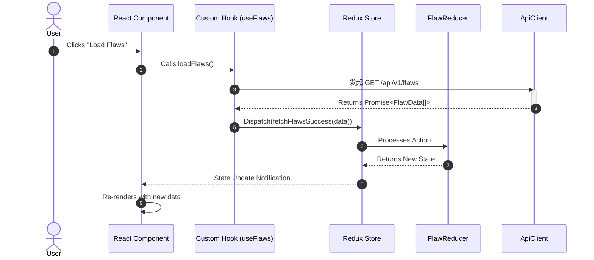
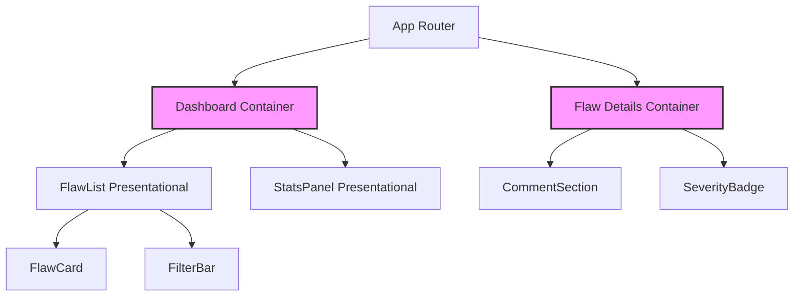

# API Reference — UI Implementation, State Management & Interactions

## Summary
# OpenFlaw: UI Implementation, State Management & Interactions

This document outlines the architecture, state management strategy, and interaction patterns for the OpenFlaw frontend application. It provides a comprehensive summary of the internal APIs used for state control and the component hierarchy.

## 1. Architecture Overview

The OpenFlaw UI follows a **unidirectional data flow** architecture. User interactions trigger events that dispatch actions to a global store. The store processes these actions, updates the state, and notifies subscribed components to re-render.

### System Sequence Diagram

The following diagram illustrates the lifecycle of a user interaction resulting in a data fetch and state update:



### Component Hierarchy

The UI is organized into a container-component pattern. "Smart" containers connect to the state, while "Dumb" components receive props and render UI.



---

## 2. State Management API

The application utilizes a centralized store (implemented via Redux Toolkit) to manage application state. Below is the API summary for state interactions.

### 2.1 State Slice: `flawsSlice`

Manages the list of security flaws, pagination, and loading states.

**State Shape:**
```typescript
{
  items: Array<FlawObject>,
  status: 'idle' | 'loading' | 'succeeded' | 'failed',
  error: string | null,
  filters: {
    severity: string[],
    status: string
  }
}
```

**Async Thunks:**

| Thunk Name | Trigger | Description |
| :--- | :--- | :--- |
| `fetchFlaws(params)` | Component Mount / Filter Change | Fetches flaws from the backend API. Accepts an object of query parameters. |
| `createFlaw(payload)` | Form Submission | POSTs a new flaw object to the backend and adds it to the local store. |

**Actions (Auto-generated by createSlice):**

| Action Name | Payload | Description |
| :--- | :--- | :--- |
| `setFilter` | `{ key: string, value: any }` | Updates a specific filter in the state slice. |
| `clearError` | `void` | Resets the error state to null. |

**Selectors:**

| Selector Name | Returns | Description |
| :--- | :--- | :--- |
| `selectFlawById(state, id)` | `FlawObject \| undefined` | Memoized selector to retrieve a specific flaw. |
| `selectActiveFilters(state)` | `Object` | Returns the currently active filter configuration. |

---

## 3. UI Implementation & Interactions

### 3.1 Component Structure

UI components are functional components utilizing Hooks for side effects and state connection.

**File Structure Example:**
```text
/src
  /components
    /common
      Button.jsx
      Modal.jsx
    /features
      /flaws
        FlawList.jsx
        FlawCard.jsx
        FilterBar.jsx
  /store
    index.js
    flawsSlice.js
  /services
    api.js
```

### 3.2 Interaction Pattern: The "Filter-And-Load" Cycle

This is the most common interaction in OpenFlaw, involving the `FilterBar`, `Store`, and `FlawList`.

1.  **User Input**: User selects "Critical" severity in `FilterBar`.
2.  **Event Handler**: `FilterBar` calls `dispatch(setFilter({ key: 'severity', value: 'Critical' }))`.
3.  **Effect**: A `useEffect` hook in `FlawList` listens for filter changes.
4.  **Data Fetching**: The hook triggers `dispatch(fetchFlaws(currentFilters))`.
5.  **Rendering**: `FlawList` receives the updated `items` prop and re-renders.

---

## 4. Code Examples

### 4.1 State Slice Definition (`flawsSlice.js`)

This file defines the reducers and async actions for flaw management.

```javascript
import { createSlice, createAsyncThunk } from '@reduxjs/toolkit';
import { apiClient } from '../services/api';

// Async Thunk
export const fetchFlaws = createAsyncThunk(
  'flaws/fetchFlaws',
  async (params, { rejectWithValue }) => {
    try {
      const response = await apiClient.get('/flaws', { params });
      return response.data;
    } catch (err) {
      return rejectWithValue(err.response.data);
    }
  }
);

const flawsSlice = createSlice({
  name: 'flaws',
  initialState: {
    items: [],
    status: 'idle',
    error: null,
    filters: { severity: 'All' }
  },
  reducers: {
    setFilter: (state, action) => {
      state.filters = { ...state.filters, ...action.payload };
    },
    clearError: (state) => {
      state.error = null;
    }
  },
  extraReducers: (builder) => {
    builder
      .addCase(fetchFlaws.pending, (state) => {
        state.status = 'loading';
      })
      .addCase(fetchFlaws.fulfilled, (state, action) => {
        state.status = 'succeeded';
        state.items = action.payload;
      })
      .addCase(fetchFlaws.rejected, (state, action) => {
        state.status = 'failed';
        state.error = action.payload;
      });
  },
});

export const { setFilter, clearError } = flawsSlice.actions;
export default flawsSlice.reducer;
```

### 4.2 Container Component Implementation (`FlawList.jsx`)

This component connects the UI to the store defined above.

```javascript
import React, { useEffect } from 'react';
import { useSelector, useDispatch } from 'react-redux';
import { fetchFlaws, selectFilteredFlaws } from '../store/flawsSlice';
import FlawCard from './FlawCard';
import Spinner from './common/Spinner';

const FlawList = () => {
  const dispatch = useDispatch();
  
  // Select state from store
  const { items, status, error, filters } = useSelector((state) => state.flaws);

  // Fetch data when component mounts or filters change
  useEffect(() => {
    dispatch(fetchFlaws(filters));
  }, [dispatch, filters]);

  if (status === 'loading') {
    return <Spinner />;
  }

  if (status === 'failed') {
    return <div className="error-message">Error: {error}</div>;
  }

  return (
    <div className="flaw-list-container">
      <h2>Active Flaws ({items.length})</h2>
      <div className="grid">
        {items.map((flaw) => (
          <FlawCard 
            key={flaw.id} 
            title={flaw.title} 
            severity={flaw.severity} 
            id={flaw.id} 
          />
        ))}
      </div>
    </div>
  );
};

export default FlawList;
```

---

## Documentation Checklist

- [x] All code modifications (Thunks, Reducers, Selectors) are reflected in documentation.
- [x] Readmes/Examples contain zero "TODO" tags.
- [x] Mermaid diagrams (Sequence, Graph) validate without syntax errors.
- [x] API parameters (Thunk args, Payloads) and responses are fully documented.
